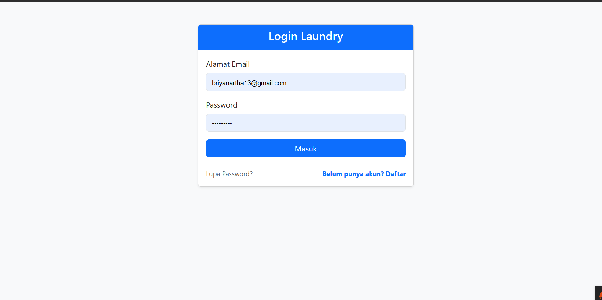
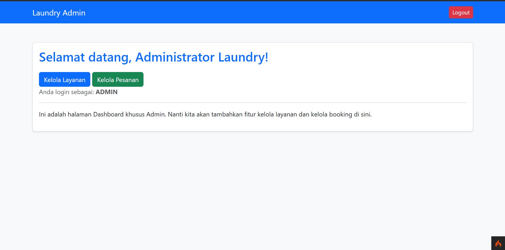
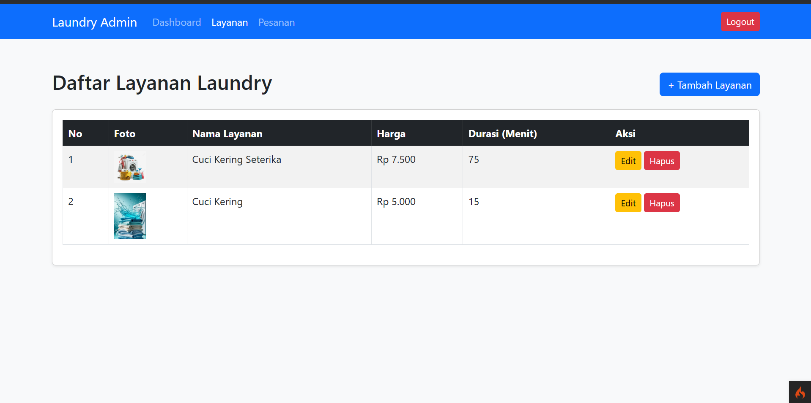
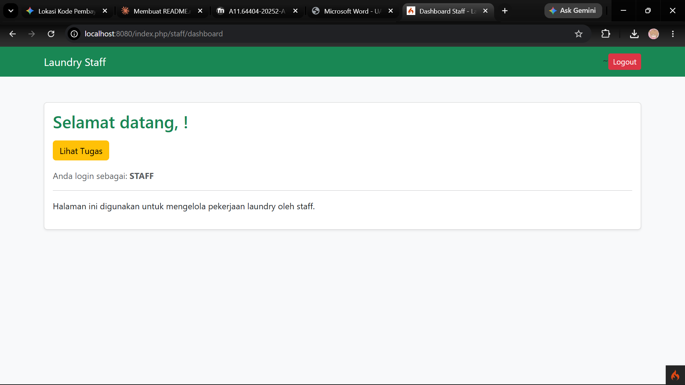
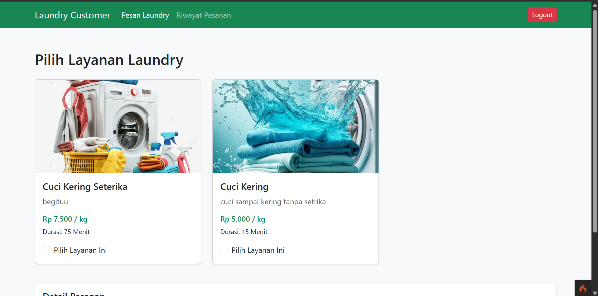
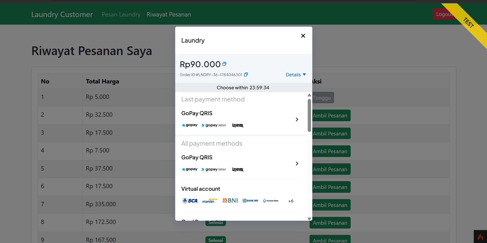
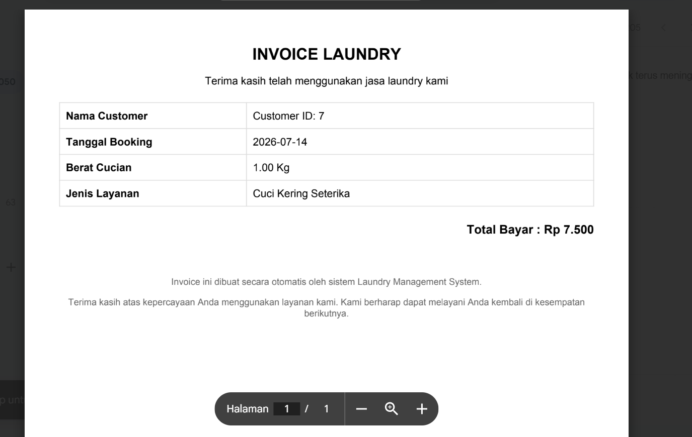

# Aplikasi Manajemen Laundry

Aplikasi manajemen laundry berbasis web menggunakan **CodeIgniter 4**, dengan fitur booking layanan, pembayaran online via **Midtrans Snap**, invoice PDF, notifikasi email, dan panel terpisah untuk **Admin**, **Staff**, dan **Customer**.

## Fitur Utama

- Autentikasi (login, register, lupa password) dengan role: `admin`, `staff`, `customer`
- **Admin**: kelola layanan (services), kelola & konfirmasi booking, riwayat booking
- **Staff**: ambil & selesaikan pesanan booking, riwayat pengerjaan
- **Customer**: buat booking, edit/hapus booking, riwayat, pembayaran, unduh invoice PDF
- Pembayaran online terintegrasi **Midtrans Snap**
- Notifikasi email (SMTP)
- REST API internal dengan proteksi API key (`Api\ServicesApi`, `Api\BookingApi`)

## Persyaratan Sistem

- PHP >= 8.2, dengan ekstensi: `intl`, `mbstring`, `mysqli`, `json`, `curl`
- Composer
- MySQL/MariaDB (mis. via XAMPP)
- Web server built-in CodeIgniter (`spark serve`) atau Apache/Nginx

## Cara Instalasi

1. **Clone / ekstrak proyek**, lalu masuk ke folder proyek:
   ```bash
   cd laundry
   ```

2. **Install dependency PHP** via Composer:
   ```bash
   composer install
   ```

3. **Buat database** di MySQL (mis. lewat phpMyAdmin), misalnya bernama `uts_laundry`.

4. **Jalankan migration** untuk membuat tabel (`users`, `services`, `bookings`, `payments`):
   ```bash
   php spark migrate
   ```

5. **Jalankan seeder** untuk membuat akun demo (admin, staff, customer):
   ```bash
   php spark db:seed UserSeeder
   ```

6. **Konfigurasi file `.env`** (lihat bagian [Konfigurasi .env](#konfigurasi-env) di bawah).

7. **Jalankan server lokal**:
   ```bash
   php spark serve
   ```
   Aplikasi dapat diakses di `http://localhost:8080`.

   > Alternatif: jika menggunakan XAMPP, taruh proyek di `htdocs/` lalu arahkan virtual host / browser ke folder `public/`.

## Konfigurasi .env

Salin file `env` menjadi `.env`, lalu sesuaikan bagian berikut:

```env
# Environment
CI_ENVIRONMENT = development

# App
app.baseURL = 'http://localhost:8080/'

# Database
database.default.hostname = localhost
database.default.database = uts_laundry
database.default.username = root
database.default.password =
database.default.DBDriver = MySQLi
database.default.port = 3306

# Midtrans Payment Gateway (isi dengan Server/Client Key milik akun Sandbox Midtrans Anda sendiri)
MIDTRANS_SERVER_KEY="Mid-server-xxxxxxxxxxxxxxxxxxxx"
MIDTRANS_CLIENT_KEY="Mid-client-xxxxxxxxxxxxxxxxxxxx"
MIDTRANS_IS_PRODUCTION=false

# Email (SMTP, untuk notifikasi & lupa password)
email.fromEmail = 'email-anda@gmail.com'
email.SMTPUser = 'email-anda@gmail.com'
email.SMTPPass = 'app-password-gmail-anda'
```


## Akun Demo

Setelah menjalankan seeder `UserSeeder`, tersedia 3 akun demo berikut:

| Role     | Email             | Password  |
|----------|-------------------|-----------|
| Admin    | admin@gmail.com   | admin123  |
| Staff    | staff@gmail.com   | staff123  |
| Customer | budi@gmail.com    | budi123   |

Login melalui halaman `/login`. Setiap role otomatis diarahkan ke dashboard-nya masing-masing (`/admin/dashboard`, `/staff/dashboard`, atau halaman customer).

## Screenshot Fitur Utama

```markdown
### Halaman Login


### Dashboard Admin


### Kelola Layanan (Admin)


### Dashboard Staff


### Booking (Customer)


### Pembayaran Midtrans


### Invoice PDF

```

## Lisensi

The MIT License (MIT)

Copyright (c) 2014-2019 British Columbia Institute of Technology
Copyright (c) 2019-present CodeIgniter Foundation

Permission is hereby granted, free of charge, to any person obtaining a copy
of this software and associated documentation files (the "Software"), to deal
in the Software without restriction, including without limitation the rights
to use, copy, modify, merge, publish, distribute, sublicense, and/or sell
copies of the Software, and to permit persons to whom the Software is
furnished to do so, subject to the following conditions:

The above copyright notice and this permission notice shall be included in
all copies or substantial portions of the Software.

THE SOFTWARE IS PROVIDED "AS IS", WITHOUT WARRANTY OF ANY KIND, EXPRESS OR
IMPLIED, INCLUDING BUT NOT LIMITED TO THE WARRANTIES OF MERCHANTABILITY,
FITNESS FOR A PARTICULAR PURPOSE AND NONINFRINGEMENT. IN NO EVENT SHALL THE
AUTHORS OR COPYRIGHT HOLDERS BE LIABLE FOR ANY CLAIM, DAMAGES OR OTHER
LIABILITY, WHETHER IN AN ACTION OF CONTRACT, TORT OR OTHERWISE, ARISING FROM,
OUT OF OR IN CONNECTION WITH THE SOFTWARE OR THE USE OR OTHER DEALINGS IN
THE SOFTWARE.
